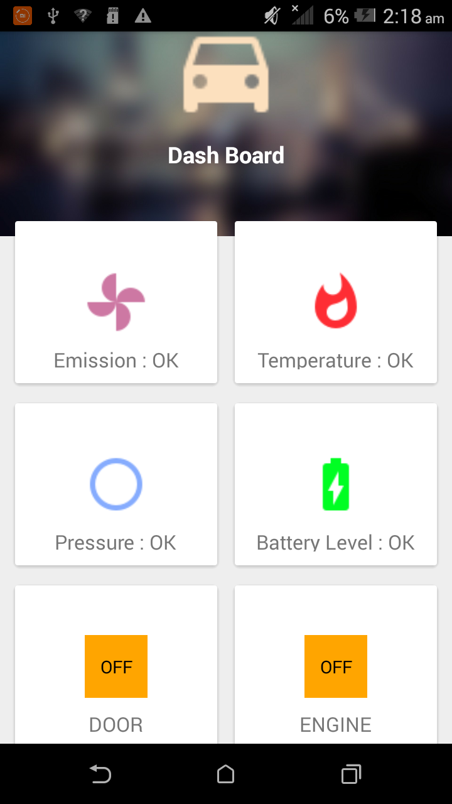

# Mobi-App
Complete project for creating andriod app which connects to google Firebase Database and Rasberry Pi.

This app connects to firebase database

Rasberry pie board with sensehat module which has all basic sensors like temparature, IMU , pressure sensor.

Pie board sends sensor reading to firebase cloud
mean while this app connects to sma e database and retrieves required data

